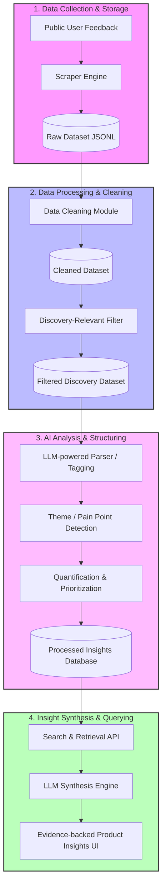

# System Architecture: Myntra AI Discovery Engine

This document outlines the pipeline and architecture of the AI Discovery Engine. 

---

## Component Details

### 1. Data Collection (Planned)
* **Sources:** Play Store reviews, App Store reviews, Reddit threads (e.g., r/IndianFashionAddicts, r/shopping), YouTube comments on fashion hauls/reviews, public fashion forums.
* **Scraper Module:** Custom scripts using tools like `google-play-scraper`, `app-store-scraper`, and `praw` (Reddit API) to gather feedback.
* **Storage:** Raw text data stored in JSON or JSONL format in `data/raw/` with metadata (source, date, rating, author).

### 2. Data Processing & Cleaning (Planned)
* **Data Cleaning Module:** 
  * Removes duplicate reviews (within and across sources).
  * Filters out spam, bot-generated content, and extremely short responses (e.g., "nice", "good").
  * Prepares text (handling emojis, casing, basic noise reduction) and saves to `data/cleaned/`.
* **Discovery-Relevant Filter:**
  * Uses keyword heuristic filtering and small embedding classifiers to keep feedback relevant to buying friction, wishlists, decision hesitation, fit issues, pricing, comparison, and post-saving behavior.
  * Filters out purely delivery, app crash, or refund payment complaints unless relevant to purchase intent.

### 3. AI Analysis (Planned)
* **Theme / Pain Point Detection:**
  * Uses LLM (Gemini API) and text embeddings to automatically classify reviews into structured themes.
  * Maps feedback to purchase barriers (e.g., size uncertainty, color representation, occasion suitability, styling confusion, trust in reviews).
* **Quantification:**
  * Aggregates occurrences of themes across data sources to measure frequency and volume.
* **Opportunity Comparison:**
  * Evaluates and compares themes based on volume, intensity of frustration, and proximity to the wishlist conversion metric. Saves processed structured JSONs to `data/processed/`.

### 4. Insight Synthesis (Planned)
* **Retrieval & LLM Synthesis:**
  * An interface where product managers can query the engine about specific user behaviors.
  * Employs Retrieval-Augmented Generation (RAG) to pull raw user quotes (evidence) matching the query and synthesizes them into actionable product insights.
* **Output:** Bulleted summaries, direct user quotes (anonymized), and confidence scores to ensure PMs do not act on false patterns.

---

## Current Component Status Matrix

| Component | Sub-component | Implemented? | Notes |
| :--- | :--- | :--- | :--- |
| **Data Collection** | App/Play Store Scraper | ❌ No | Planned for Phase 1 |
| **Data Collection** | Reddit/Social Scraper | ❌ No | Planned for Phase 1 |
| **Data Processing** | Deduplication & Cleaning | ❌ No | Planned for Phase 2 |
| **Data Processing** | Relevance Filter | ❌ No | Planned for Phase 3 |
| **AI Analysis** | Theme & Pain Point Tagging | ❌ No | Planned for Phase 4 |
| **AI Analysis** | Quantification & Comparison | ❌ No | Planned for Phase 5 |
| **Insight Synthesis**| Query Retrieval | ❌ No | Planned for Phase 5 / App setup |
| **Insight Synthesis**| LLM Evidence Synthesis | ❌ No | Planned for Phase 5 / App setup |
| **User Interface** | Web App (Streamlit/Flask) | ❌ No | Planned for MVP Phase |
